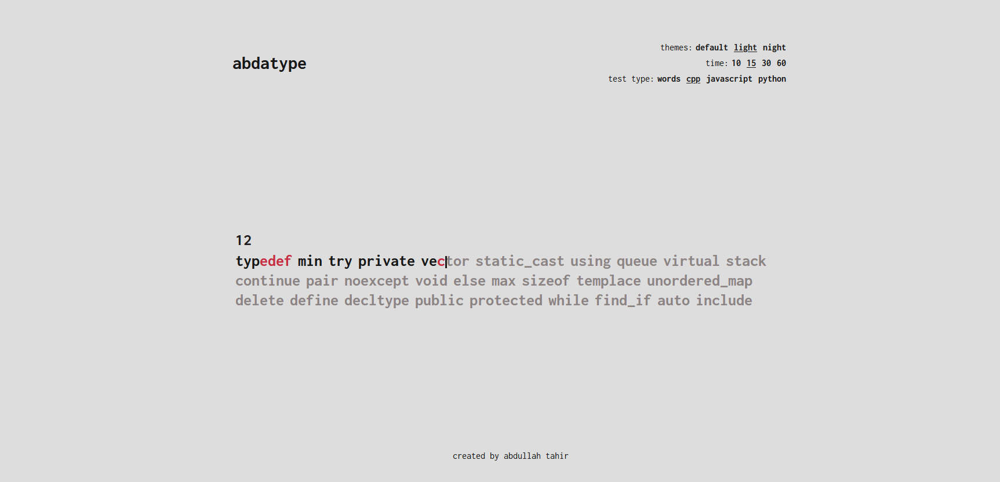

# abdatype

## What is it?
**abdatype** is my attempt at creating a speed typing test application that aims to improve the coding fluency of programmers (such as myself)! 
Developed using React, *abdatype* currently holds the ability to:
- Scroll through text dynamically as the user completes the test (with the help of our friend the caret '|').
- Provide immediate feedback based on the accuracy of the user through the highlighting of incorrect characters.
- Permit the customisation of test settings such as the theme, test time, and test type.
- Be aesthetically pleasing (UI inspiration was taken from not only [monkeytype.com](https://monkeytype.com/) but also some other amazing typing tests).





## How can you try it?
See my [portfolio website](https://abda-1.github.io/)

Or run locally:
```
git clone https://github.com/abda-1/abdatype.git
cd abdatype
npm install
npm start
npm run build
```

## What's in store for the future? 
- **Algorithm Based Typing Tests**
- **C++ Lambda Expression Practice**
- **More themes**